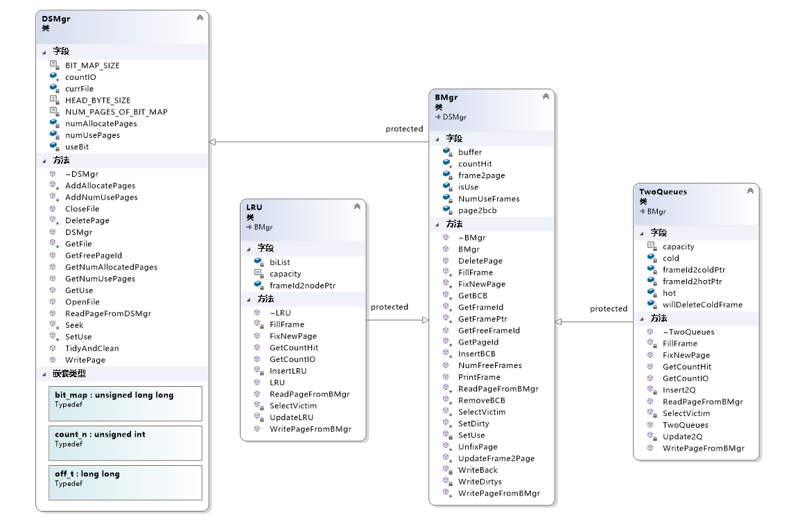
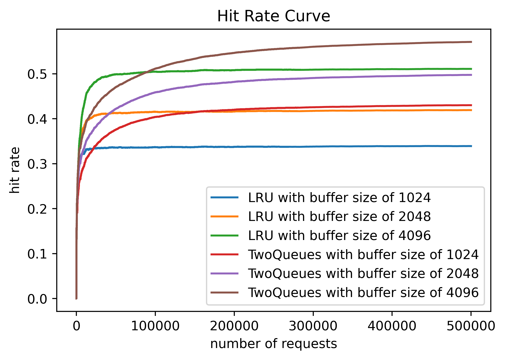
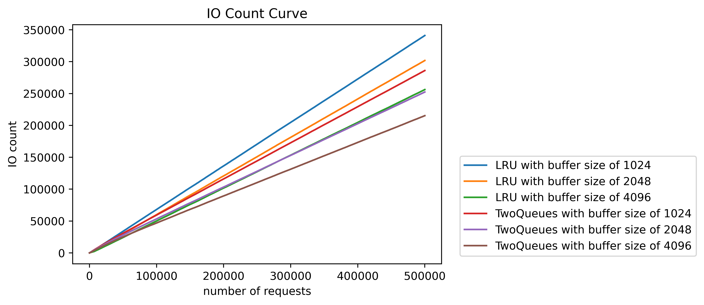



# 实现Storage and Buffer Manager #

## 功能模块 ##
&emsp;&emsp;以下为各个功能模块视图：

## 问题与解决 ##
- 指针陷阱，由于项目开发采用C++，不可避免地与指针打交道。在更新散列`page2bcb`时，当删除的元素位于表首时，表首元素将无法得到更新，通过日志DEBUG到错误位置后，添加了对应判断语句，解决了内存泄露的问题。
- 当文件以读取写入形式打开时，无法在中间位置更新page，通过查看其API说明，得出其主要原因是原本文件指针打开方式为`ab+`，对应代码片段为`fopen_s(&currFile, (filename).c_str(), "ab+")`，这种打开方式为追加写入，即使文件指针通过`fseek`方式定位到预写位置，在执行`fwrite`时，由于该函数会判断文件打开方式为`ab+`，所以仍然会在文件末尾写入。通过将`ab+`改成`rb+`，成功解决此问题。
- 当项目构建完成时，由于VS默认为Debug模式，所创建对应的exe也为DEBUG环境下的，代码并未得到优化。找到问题后，将VS设置为Realease，重新编译生成，最终算法运行速度快了接近1s。
- 在得到性能文件`data.out`后，发现总IO次数比总页面访问请求次数50w还多，这明显与违反事实。经过DEBUG，发现在设计顶层类函数`WritePageFromBMgr`时，出现逻辑错误。在原项目中，写入page时，当page不在缓冲中，会通过一次IO将磁盘中page调入内存，进而在缓冲中进行写操作。这种策略会使得该page在操作过程额外增加了一次IO。正确的做法应该时逻辑上创建frame到page的映射，然后直接对frame进行写操作，当frame被替换或数据库关闭时，再将dirty frame写回page，这样操作只有一次IO。

## 实验结果 ##
&emsp;&emsp;本次实验中分别对LRU算法和2Q算法进行了系列性能对比测试，主要测试了在data-2w-50w-zipf.txt中的命令输入下，存储缓冲管理器的运行时间、缓存命中率和磁盘IO次数。在相同的算法中，通过改变缓冲区容量`DEFBUFSIZE`为1024、2048和4096，得到了同一个算法在不同缓冲区规模下的性能变化。实验结果绘制图如下：

&emsp;&emsp;从命中率曲线图得出，在同等规模的缓冲区下，2Q的命中率普遍比LRU更高，LRU算法命中率普遍更早的比2Q算法命中率进入收敛；在随着缓冲区增大，LRU算法和2Q算法的命中率都有一定幅度的增大，同时算法命中率到达收敛所需的访问请求都有一定的增加。

&emsp;&emsp;从磁盘IO曲线图得出，LRU算法和2Q算法的与磁盘IO次数随着页面访问请求呈现线性增加。在同等规模的缓冲区下，2Q算法与磁盘IO次数皆低于LRU；随着缓冲区规模增加，对应算法的总IO次数皆有一定程度的降低。
&emsp;&emsp;在50w个页面请求下，对应算法性能参数表如下：

|algorithm |    hit rate   |  IO     |cost time(s)|
|:--------:|:-------------:|:-------:|:------:|
| LRU 1024 |     33.91%    | 341,001 |  3.139 |
| LRU 2048 |     41.91%    | 301,827 |  2.811 |
| LRU 4096 |     51.09%    | 256,205 |  2.571 |
| 2Q 1024  |     43.01%    | 286,058 |  3.056 |
| 2Q 2048  |     49.75%    | 252,383 |  2.727 |
| 2Q 4096  |     57.08%    | 215,255 |  2.403 |

&emsp;&emsp;从表中可以看出在命中率和与磁盘的IO次数性能表现上，2Q全面优于LRU，但是最终运行时间上，2Q并未过多的优于LRU，比如2Q在1024容量的缓存下，虽然命中率和IO次数都优于LRU在2048容量缓存下的性能，但最终的运行时间结果却是前者长于后者。分析其原因，主要由于2Q增加了cold和hot机制虽然使得算法适应力更强，但是同时也增加了额外的维护开销，使得2Q运行时间性能最终表现并未大幅度超越LRU，后续可以优化2Q数据结构和对应维护算法来降低这部分维护额外开销。